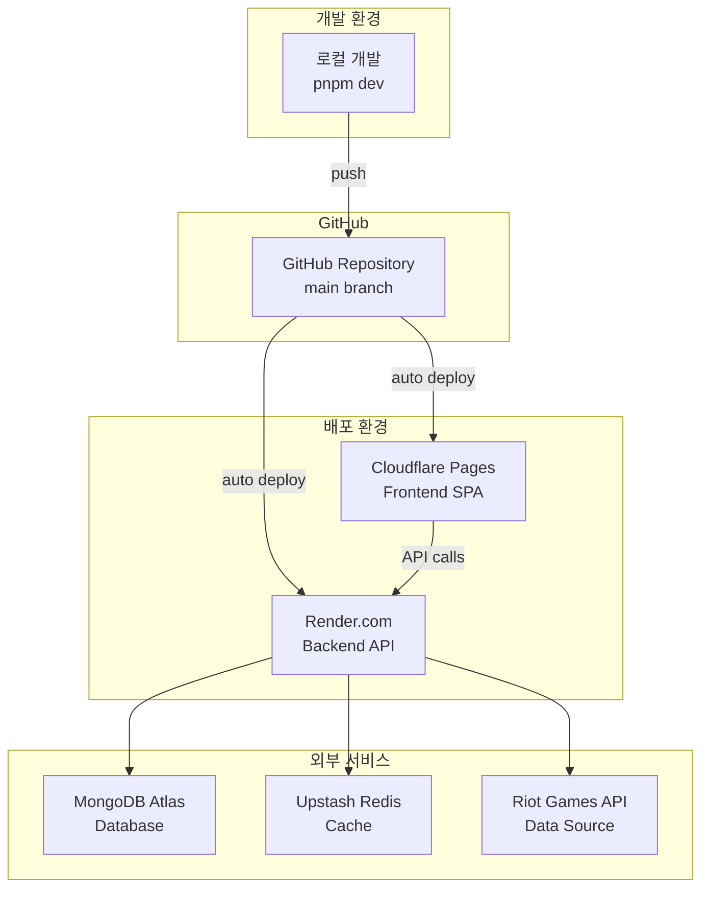
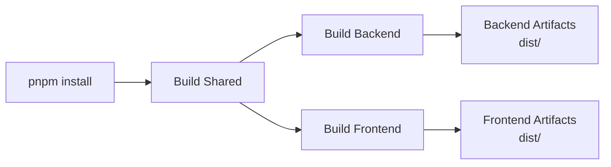
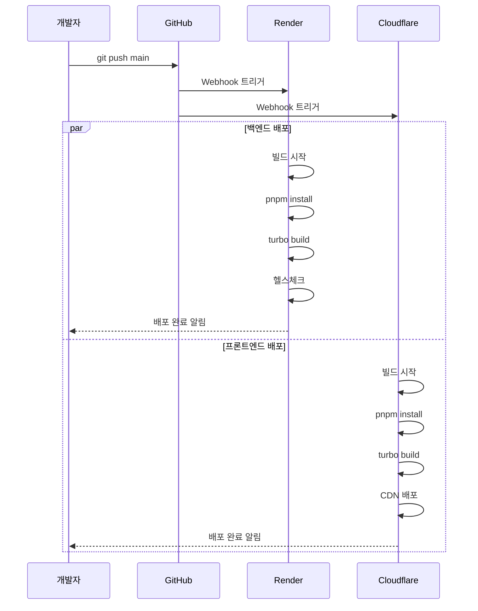

# 🚀 TFT Meta Analyzer - 배포 아키텍처 가이드

> **로컬 개발부터 프로덕션 배포까지** - AI CLI 도구를 위한 배포 프로세스 상세 가이드

## 📊 배포 아키텍처 개요

TFT Meta Analyzer는 **비용 효율적**이면서도 **확장 가능한** 아키텍처를 채택하여, 백엔드는 Render.com에, 프론트엔드는 Cloudflare Pages에 배포됩니다.



## 🏗️ 환경별 구성

### 🔧 로컬 개발 환경

#### 시작 방법
```bash
# 1. 환경변수 설정
cp backend/.env.example backend/.env
cp frontend/.env.example frontend/.env

# 2. 의존성 설치
pnpm install

# 3. 개발 서버 실행
pnpm dev  # 백엔드(4001) + 프론트엔드(5173) 동시 실행
```

#### 로컬 환경 특징
- **Hot Reload**: 코드 변경 시 자동 재시작
- **TypeScript 감시**: 실시간 타입 체크
- **통합 로깅**: 터미널에서 모든 로그 확인
- **Proxy 설정**: 프론트엔드에서 백엔드 API 자동 프록시

### 🌐 프로덕션 환경

#### 백엔드 (Render.com)
```yaml
# render.yaml 설정
services:
  - type: web
    name: tft-meta-analyzer-backend
    runtime: node
    region: singapore
    buildCommand: |
      corepack enable &&
      pnpm install --frozen-lockfile &&
      turbo build --filter=@tft-meta-analyzer/backend...
    startCommand: cd backend && pnpm start
```

**특징:**
- **자동 배포**: GitHub push 시 자동 빌드/배포
- **헬스체크**: `/health` 엔드포인트 모니터링
- **환경변수**: Render 대시보드에서 안전하게 관리
- **SSL**: 자동 HTTPS 인증서 발급

#### 프론트엔드 (Cloudflare Pages)
```toml
# wrangler.toml 설정
[build]
command = "corepack enable && pnpm install --frozen-lockfile && npx turbo build --filter=@tft-meta-analyzer/frontend..."
dir = "frontend/dist"

[env.production.vars]
NODE_ENV = "production"
VITE_API_BASE_URL = "https://tft-meta-analyzer-backend.onrender.com"
```

**특징:**
- **글로벌 CDN**: 전 세계 엣지 서버에 배포
- **자동 최적화**: 이미지/JS/CSS 자동 압축
- **무료 SSL**: 자동 HTTPS 인증서
- **빠른 빌드**: 병렬 빌드 프로세스

## 🔧 빌드 프로세스

### 모노레포 빌드 파이프라인



### 백엔드 빌드 과정
1. **TypeScript 컴파일**: `src/` → `dist/`
2. **데이터 파일 복사**: JSON 파일 복사
3. **Import 경로 수정**: ESM 호환성 처리
4. **의존성 설치**: 프로덕션 의존성만

### 프론트엔드 빌드 과정
1. **Vite 번들링**: 최적화된 청크 생성
2. **코드 분할**: 페이지별/라이브러리별 분할
3. **자산 최적화**: 이미지/폰트 압축
4. **환경변수 주입**: `VITE_` 접두사 변수

## 🔐 환경변수 관리

### 환경변수 계층 구조

```
프로덕션 환경변수
├── 백엔드 (Render)
│   ├── 필수
│   │   ├── RIOT_API_KEY
│   │   └── MONGODB_URI
│   ├── 선택
│   │   ├── UPSTASH_REDIS_URL
│   │   ├── GEMINI_API_KEY
│   │   └── GOOGLE_AI_MAIN_API_KEY
│   └── 자동 설정 (render.yaml)
│       ├── NODE_ENV=production
│       ├── MONGODB_TIMEOUT=10000
│       └── TFT_DATA_TIMEOUT=15000
│
└── 프론트엔드 (Cloudflare)
    ├── 필수
    │   ├── NODE_ENV=production
    │   └── VITE_API_BASE_URL
    └── 선택
        ├── VITE_ENABLE_DEBUG_MODE
        └── VITE_DEFAULT_LANGUAGE
```

### 보안 고려사항
- **절대 커밋 금지**: `.env` 파일은 `.gitignore`에 포함
- **환경별 분리**: 개발/스테이징/프로덕션 환경변수 분리
- **최소 권한**: 각 환경에 필요한 최소한의 권한만 부여
- **정기 로테이션**: API 키 정기적 갱신

## 🚀 배포 프로세스

### 자동 배포 플로우



### 수동 배포 방법

#### 백엔드 수동 배포
```bash
# Render CLI 사용
render deploy --service tft-meta-analyzer-backend

# 또는 대시보드에서 "Manual Deploy" 클릭
```

#### 프론트엔드 수동 배포
```bash
# Wrangler CLI 사용
cd frontend
npx wrangler pages deploy dist

# 또는 Cloudflare 대시보드에서 수동 배포
```

## 🔍 모니터링 및 로깅

### 백엔드 모니터링 (Render)
- **실시간 로그**: Render 대시보드 Logs 탭
- **메트릭스**: CPU/Memory/Response Time
- **알림**: 다운타임 시 이메일 알림
- **헬스체크**: 30초마다 `/health` 확인

### 프론트엔드 모니터링 (Cloudflare)
- **Analytics**: 방문자 수, 대역폭 사용량
- **Web Vitals**: Core Web Vitals 측정
- **에러 추적**: JavaScript 에러 로깅
- **실시간 로그**: Workers 로그 스트림

### 통합 모니터링 도구
```javascript
// 백엔드 로깅 (Winston)
logger.info('API request', {
  method: req.method,
  path: req.path,
  duration: responseTime
});

// 프론트엔드 에러 추적
window.addEventListener('error', (event) => {
  console.error('Global error:', event.error);
  // Sentry나 LogRocket 연동 가능
});
```

## 🔧 문제 해결 가이드

### 자주 발생하는 배포 문제

#### 1. 빌드 실패
```bash
# 증상: "Cannot find module" 에러
# 해결:
1. package.json의 의존성 확인
2. pnpm-lock.yaml 재생성
   pnpm install --force
3. turbo.json의 빌드 순서 확인
```

#### 2. 환경변수 누락
```bash
# 증상: "undefined" 에러, API 연결 실패
# 해결:
1. Render/Cloudflare 대시보드 확인
2. 변수명 오타 체크 (VITE_ 접두사)
3. 빌드 로그에서 환경변수 출력 확인
```

#### 3. CORS 에러
```bash
# 증상: "CORS policy blocked"
# 해결:
1. 백엔드 ALLOWED_ORIGINS 환경변수 확인
2. 프론트엔드 실제 배포 URL 확인
3. render.yaml의 CORS 설정 업데이트
```

#### 4. MongoDB 연결 실패
```bash
# 증상: "MongoNetworkError"
# 해결:
1. MongoDB Atlas Network Access 확인
2. IP Whitelist에 0.0.0.0/0 추가
3. Connection String 형식 확인
```

## 📊 성능 최적화

### 백엔드 최적화
- **캐싱 전략**: Redis + 인메모리 이중 캐싱
- **연결 풀링**: MongoDB 연결 재사용
- **압축**: Gzip 응답 압축
- **레이트 리미팅**: API 남용 방지

### 프론트엔드 최적화
- **코드 분할**: 라우트별 지연 로딩
- **자산 최적화**: 이미지 WebP 변환
- **CDN 활용**: Cloudflare 엣지 캐싱
- **번들 크기**: Tree-shaking으로 불필요한 코드 제거

## 🔒 보안 고려사항

### 백엔드 보안
```javascript
// Helmet.js로 보안 헤더 설정
app.use(helmet({
  contentSecurityPolicy: {
    directives: {
      defaultSrc: ["'self'"],
      styleSrc: ["'self'", "'unsafe-inline'"]
    }
  }
}));
```

### 프론트엔드 보안
- **HTTPS 강제**: 모든 트래픽 암호화
- **XSS 방지**: React 자동 이스케이핑
- **CSP 헤더**: Cloudflare에서 설정
- **환경변수**: 민감한 정보 노출 방지

## 🚦 배포 체크리스트

### 배포 전 확인사항
- [ ] 모든 테스트 통과 (`pnpm test`)
- [ ] TypeScript 컴파일 성공 (`pnpm type-check`)
- [ ] 환경변수 준비 완료
- [ ] 로컬에서 프로덕션 빌드 테스트
- [ ] API 엔드포인트 동작 확인

### 배포 후 확인사항
- [ ] 헬스체크 정상 응답
- [ ] 주요 페이지 로딩 확인
- [ ] API 연결 상태 확인
- [ ] 에러 로그 모니터링
- [ ] 성능 메트릭 확인

## 🔗 유용한 링크

### 공식 문서
- [Render 문서](https://render.com/docs)
- [Cloudflare Pages 문서](https://developers.cloudflare.com/pages/)
- [Turbo 문서](https://turbo.build/repo/docs)
- [pnpm 문서](https://pnpm.io/)

### 대시보드 링크
- Render: `https://dashboard.render.com/`
- Cloudflare: `https://dash.cloudflare.com/`
- MongoDB Atlas: `https://cloud.mongodb.com/`

---

**💡 팁**: 배포 시 항상 `main` 브랜치를 최신 상태로 유지하고, 큰 변경사항은 별도 브랜치에서 테스트 후 머지하세요. Render와 Cloudflare 모두 Preview 환경을 지원하므로 활용하면 좋습니다.