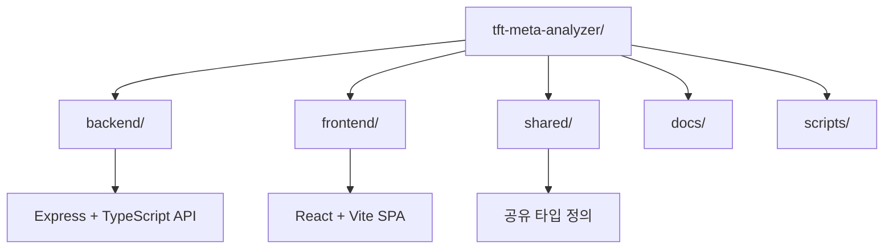
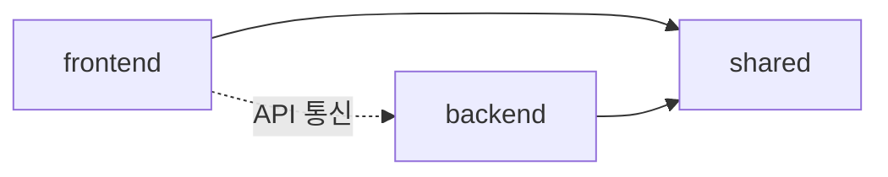

# 🏗️ TFT Meta Analyzer - 프로젝트 구조 상세 가이드

> **AI CLI 도구를 위한 프로젝트 구조 이해 가이드** - 모노레포 아키텍처와 각 구성 요소의 역할

## 📊 프로젝트 개요

TFT Meta Analyzer는 **pnpm Workspaces + Turbo**를 활용한 모노레포 구조로 구성되어 있습니다. 이 구조는 백엔드, 프론트엔드, 공유 패키지를 효율적으로 관리하고, AI CLI 도구가 쉽게 이해하고 수정할 수 있도록 설계되었습니다.



## 🗂️ 디렉토리 구조

```
tft-meta-analyzer/                   # 🏗️ 모노레포 루트
├── 📋 README.md                     # 프로젝트 전체 가이드
├── 📋 CLAUDE.md                     # AI CLI 도구 사용법
├── 📋 PROJECT_STRUCTURE.md          # 현재 문서
├── 📋 DEPLOYMENT.md                 # 배포 가이드
├── 📦 package.json                  # 루트 패키지 (Turbo 스크립트)
├── 🔧 pnpm-workspace.yaml           # pnpm 워크스페이스 설정
├── ⚙️  turbo.json                   # Turbo 빌드 파이프라인
├── 🚀 render.yaml                   # Render.com 배포 설정
├── ☁️  wrangler.toml                # Cloudflare Pages 설정
│
├── 📦 backend/                      # 백엔드 패키지
│   ├── src/                         # 소스 코드
│   │   ├── 🚀 server.ts            # Express 서버 진입점
│   │   ├── ⚙️  config/              # 설정 파일들
│   │   ├── 🛤️  routes/             # API 라우트 (15개+)
│   │   ├── 🔧 services/            # 비즈니스 로직
│   │   ├── 📊 models/              # MongoDB 스키마
│   │   ├── 🛡️  middlewares/        # Express 미들웨어
│   │   ├── 🔗 types/               # TypeScript 타입
│   │   ├── 🛠️  utils/              # 유틸리티 함수
│   │   └── 🤖 initialization/      # 서버 초기화 모듈
│   ├── 📦 package.json              # 백엔드 의존성
│   └── 🔧 tsconfig.json            # TypeScript 설정
│
├── 🎨 frontend/                     # 프론트엔드 패키지
│   ├── src/                         # 소스 코드
│   │   ├── 🚀 main.tsx             # React 앱 진입점
│   │   ├── 📱 App.tsx              # 루트 컴포넌트
│   │   ├── 📄 pages/               # 페이지 컴포넌트 (9개+)
│   │   ├── 🧩 components/          # 재사용 컴포넌트
│   │   ├── 🎣 hooks/               # 커스텀 React 훅
│   │   ├── 🌍 context/             # React Context
│   │   ├── 🔗 api/                 # API 통신 레이어
│   │   └── 🔗 types/               # TypeScript 타입
│   ├── 📦 package.json              # 프론트엔드 의존성
│   ├── ⚡ vite.config.js           # Vite 빌드 설정
│   └── 🔧 tsconfig.json            # TypeScript 설정
│
├── 🔗 shared/                       # 공유 패키지
│   ├── src/                         # 공유 코드
│   │   ├── 📝 types.ts             # 공통 타입 정의
│   │   ├── 🔧 tooltipParser.ts     # 툴팁 파서
│   │   └── 📋 index.ts             # 패키지 진입점
│   ├── 📦 package.json              # @tft-meta-analyzer/shared
│   └── 🔧 tsconfig.json            # TypeScript 설정
│
├── 📚 docs/                         # 문서 디렉토리
│   ├── 📋 adr/                     # 아키텍처 결정 기록
│   └── 📋 *.md                     # 각종 가이드 문서
│
└── 🧪 scripts/                      # 유틸리티 스크립트
    ├── test/                        # 테스트 스크립트
    ├── security/                    # 보안 검사 스크립트
    └── code-analysis/               # 코드 분석 도구
```

## 🔑 핵심 파일 설명

### 📦 루트 설정 파일들

#### `package.json` (루트)
```json
{
  "name": "tft-meta-analyzer-monorepo",
  "scripts": {
    "dev": "pnpm install && turbo dev",
    "build": "pnpm install && turbo build",
    "test": "turbo test"
  }
}
```
- **역할**: 모노레포 전체 스크립트 관리
- **핵심 명령어**: `pnpm dev` (전체 개발 서버), `pnpm build` (전체 빌드)

#### `pnpm-workspace.yaml`
```yaml
packages:
  - 'frontend'
  - 'backend' 
  - 'shared'
```
- **역할**: pnpm 워크스페이스 패키지 정의
- **기능**: 패키지 간 의존성 자동 연결

#### `turbo.json`
```json
{
  "tasks": {
    "build": {
      "dependsOn": ["^build"],
      "outputs": ["dist/**"]
    },
    "dev": {
      "cache": false,
      "persistent": true
    }
  }
}
```
- **역할**: Turbo 빌드 파이프라인 정의
- **특징**: 의존성 순서대로 빌드, 캐싱 최적화

### 📦 Backend 구조

#### 주요 디렉토리 설명

##### `src/routes/` (15개+ 라우트)
- `health.ts` - 헬스체크 엔드포인트
- `tierlist.ts` - 티어리스트 API
- `summoner.ts` - 소환사 정보 API
- `match.ts` - 매치 데이터 API
- `ai.ts` - AI 분석 API
- `staticData.ts` - 정적 데이터 API
- `ranking.ts` - 랭킹 API
- `guides.ts` - 가이드 API
- `cache.ts` - 캐시 관리 API
- `dashboard.ts` - 대시보드 API
- `deckBuilder.ts` - 덱 빌더 API
- `errorMonitor.ts` - 에러 모니터링 API
- `mcp.ts` - MCP 서버 API
- `performance.ts` - 성능 모니터링 API
- `translation.ts` - 번역 API

##### `src/services/` (비즈니스 로직)
- `riotApi.ts` - Riot Games API 통신
- `tftData.ts` - TFT 정적 데이터 관리
- `cacheManager.ts` - 캐싱 시스템
- `ai/` - AI 서비스 모듈
  - `AIAnalysisService.ts`
  - `QnAService.ts`
- `scheduler.ts` - 크론 작업 스케줄러
- `alertService.ts` - 알림 서비스

##### `src/initialization/` (서버 초기화)
- `coreModules.ts` - 핵심 모듈 초기화
- `envLoader.ts` - 환경변수 로드 및 검증
- `routeSetup.ts` - Express 라우트 설정
- `staticDataLoader.ts` - 정적 데이터 로딩

### 🎨 Frontend 구조

#### 주요 디렉토리 설명

##### `src/pages/` (페이지 컴포넌트)
- `HomePage.tsx` - 홈페이지
- `summoner/SummonerPage.tsx` - 소환사 프로필
- `tierlist/TierListPage.tsx` - 티어리스트
- `ranking/RankingPage.tsx` - 랭킹 페이지
- `stats/StatsPage.tsx` - 통계 페이지
- `DeckBuilderPage/` - 덱 빌더
- `AiQnaPage/` - AI Q&A
- `GuideListPage/` - 가이드 목록
- `AboutPage/` - 소개 페이지

##### `src/components/` (재사용 컴포넌트)
- `common/` - 공통 UI 컴포넌트
- `layout/` - 레이아웃 컴포넌트
- `app/` - 앱 레벨 컴포넌트
- `routing/` - 라우팅 관련 컴포넌트

##### `src/context/` (상태 관리)
- `TFTDataContext.tsx` - TFT 데이터 전역 상태
- `TFTStaticDataContext.tsx` - 정적 데이터 컨텍스트
- `DarkModeContext.tsx` - 다크모드 상태
- `UIStateContext.tsx` - UI 상태 관리

### 🔗 Shared 구조

#### 공유 타입 및 유틸리티
- `types.ts` - 백엔드/프론트엔드 공통 타입
- `tooltipParser.ts` - 툴팁 파싱 유틸리티
- `index.ts` - 패키지 익스포트

## 🔄 패키지 간 의존성



### 의존성 관계
1. **frontend** → **shared**: 공통 타입 사용
2. **backend** → **shared**: 공통 타입 사용
3. **frontend** ↔ **backend**: HTTP API 통신

### 패키지 명명 규칙
- Backend: `@tft-meta-analyzer/backend`
- Frontend: `@tft-meta-analyzer/frontend`
- Shared: `@tft-meta-analyzer/shared`

## 🛠️ 빌드 시스템

### Turbo 파이프라인
1. **shared** 빌드 (타입 정의)
2. **backend** 빌드 (TypeScript → JavaScript)
3. **frontend** 빌드 (Vite 번들링)

### 빌드 명령어
```bash
# 전체 빌드
pnpm build

# 특정 패키지만 빌드
pnpm --filter backend build
pnpm --filter frontend build

# 의존성 포함 빌드
turbo build --filter=@tft-meta-analyzer/backend...
```

## 🔧 개발 환경 설정

### 필수 도구
- **Node.js**: 18.0.0+ (ESM 지원)
- **pnpm**: 9.15.9+ (워크스페이스)
- **TypeScript**: 5.8.3 (엄격 모드)

### 환경변수 파일 위치
- Backend: `backend/.env`
- Frontend: `frontend/.env`
- 예시: `backend/.env.example`

## 📝 AI CLI 작업 시 주의사항

### 파일 수정 시
1. **타입 체크**: 수정 후 `pnpm type-check` 실행
2. **의존성**: shared 타입 수정 시 양쪽 패키지 확인
3. **빌드 순서**: Turbo가 자동으로 처리

### 새 기능 추가 시
1. **타입 먼저**: `shared/src/types.ts`에 타입 정의
2. **백엔드**: 서비스 → 라우트 순서로 구현
3. **프론트엔드**: API 레이어 → 컴포넌트 순서로 구현

### 디버깅 팁
- 빌드 오류: `turbo.json`의 의존성 확인
- 타입 오류: `tsconfig.json`의 경로 매핑 확인
- 런타임 오류: 환경변수 설정 확인

## 🚀 빠른 시작 명령어

```bash
# 1. 의존성 설치
pnpm install

# 2. 개발 서버 실행
pnpm dev

# 3. 타입 체크
pnpm type-check

# 4. 빌드
pnpm build

# 5. 테스트
pnpm test
```

---

**💡 팁**: AI CLI 도구로 작업 시, 항상 루트 디렉토리에서 시작하고 `pnpm` 명령어를 사용하세요. Turbo가 자동으로 올바른 순서로 작업을 처리합니다.