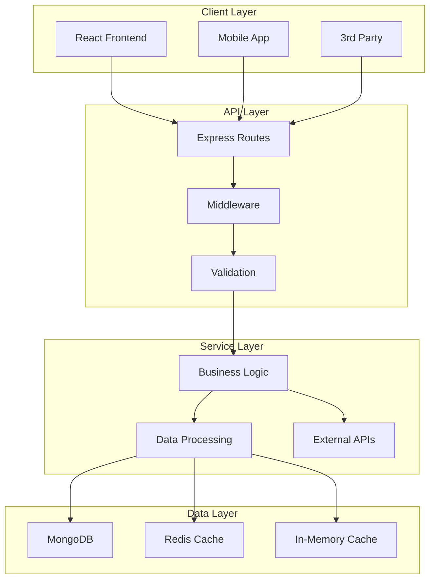

# 🔧 TFT Meta Analyzer - 서비스 및 API 가이드

> **백엔드 서비스 아키텍처와 API 엔드포인트** - AI CLI 도구를 위한 상세 가이드

## 📊 서비스 아키텍처 개요

TFT Meta Analyzer의 백엔드는 **계층화된 아키텍처**를 채택하여 관심사를 명확히 분리하고 있습니다.



## 🛤️ API 엔드포인트 목록

### 📋 기본 정보 API

#### `GET /` - API 상태 확인
```javascript
// 응답 예시
{
  "message": "TFT Meta Analyzer API is running.",
  "version": "1.0.0",
  "environment": "production"
}
```

#### `GET /health` - 헬스체크
```javascript
// 응답 예시
{
  "status": "healthy",
  "timestamp": "2024-01-20T10:00:00Z",
  "services": {
    "database": "connected",
    "cache": "connected",
    "riotApi": "available"
  }
}
```

### 🎮 게임 데이터 API

#### `GET /api/static-data/champions` - 챔피언 정보
```javascript
// 쿼리 파라미터
?language=ko  // 언어 설정 (ko, en, ja, zh)

// 응답 예시
{
  "success": true,
  "data": {
    "TFTChampions": {
      "TFT_Champion_Name": {
        "name": "챔피언 이름",
        "cost": 3,
        "traits": ["특성1", "특성2"]
      }
    }
  }
}
```

#### `GET /api/static-data/traits` - 특성 정보
```javascript
// 응답 구조
{
  "success": true,
  "data": {
    "traits": [{
      "key": "trait_key",
      "name": "특성 이름",
      "description": "특성 설명",
      "effects": [...]
    }]
  }
}
```

#### `GET /api/static-data/items` - 아이템 정보
```javascript
// 응답 구조
{
  "success": true,
  "data": {
    "items": [{
      "id": 1,
      "name": "아이템 이름",
      "description": "아이템 설명",
      "recipe": [component1, component2]
    }]
  }
}
```

### 👤 소환사 API

#### `GET /api/summoner/by-name/:summonerName` - 소환사 검색
```javascript
// 파라미터
:summonerName - 소환사 이름
?region=kr     // 지역 설정

// 응답 예시
{
  "success": true,
  "data": {
    "puuid": "player_uuid",
    "summonerId": "summoner_id",
    "profileIconId": 1234,
    "summonerLevel": 100
  }
}
```

#### `GET /api/summoner/:puuid/matches` - 매치 히스토리
```javascript
// 파라미터
:puuid - 플레이어 고유 ID
?count=20  // 매치 수 (기본값: 20)

// 응답 구조
{
  "success": true,
  "data": {
    "matches": [{
      "matchId": "match_id",
      "placement": 1,
      "traits": [...],
      "units": [...],
      "augments": [...]
    }]
  }
}
```

### 📊 통계 및 메타 API

#### `GET /api/tierlist` - 티어리스트
```javascript
// 쿼리 파라미터
?type=champion  // champion, item, trait, comp
?tier=all       // S, A, B, C, D, all

// 응답 예시
{
  "success": true,
  "data": {
    "lastUpdated": "2024-01-20T10:00:00Z",
    "tierlist": {
      "S": ["Champion1", "Champion2"],
      "A": ["Champion3", "Champion4"],
      "B": [...]
    }
  }
}
```

#### `GET /api/meta/compositions` - 메타 조합
```javascript
// 응답 구조
{
  "success": true,
  "data": {
    "compositions": [{
      "id": "comp_id",
      "name": "조합 이름",
      "tier": "S",
      "champions": [...],
      "traits": [...],
      "winRate": 15.5,
      "playRate": 8.2
    }]
  }
}
```

### 🤖 AI 서비스 API

#### `POST /api/ai/analyze` - AI 매치 분석
```javascript
// 요청 바디
{
  "matchData": {
    "placement": 3,
    "units": [...],
    "traits": [...],
    "augments": [...]
  },
  "language": "ko"
}

// 응답 예시
{
  "success": true,
  "data": {
    "analysis": "AI 분석 결과...",
    "suggestions": [...],
    "grade": "A+"
  }
}
```

#### `POST /api/ai/qna` - AI Q&A
```javascript
// 요청 바디
{
  "question": "현재 메타에서 가장 강한 조합은?",
  "context": "patch_14.1"
}

// 응답
{
  "success": true,
  "data": {
    "answer": "AI 답변...",
    "sources": ["source1", "source2"]
  }
}
```

### 🏆 랭킹 API

#### `GET /api/ranking/top` - 상위 랭커
```javascript
// 쿼리 파라미터
?region=kr    // 지역
?count=100    // 랭커 수

// 응답 구조
{
  "success": true,
  "data": {
    "rankings": [{
      "rank": 1,
      "summonerName": "플레이어명",
      "tier": "Challenger",
      "lp": 1200,
      "winRate": 32.5
    }]
  }
}
```

## 🔧 핵심 서비스 상세

### 📡 RiotApi Service
```typescript
// services/riotApi.ts
class RiotApiService {
  // Riot Games API와의 모든 통신 담당
  // Rate Limiting 자동 처리
  // 에러 재시도 로직 포함
  
  async getSummoner(name: string, region: string)
  async getMatches(puuid: string, count: number)
  async getMatchDetails(matchId: string)
}
```

**특징:**
- 자동 레이트 리미팅 (100req/2min)
- 지역별 엔드포인트 자동 선택
- 429 에러 시 자동 재시도
- 응답 캐싱

### 💾 CacheManager Service
```typescript
// services/cacheManager.ts
class CacheManager {
  // 이중 캐싱 시스템 관리
  // 1차: In-Memory (NodeCache)
  // 2차: Redis (Upstash)
  
  async get(key: string): Promise<any>
  async set(key: string, value: any, ttl?: number)
  async invalidate(pattern: string)
}
```

**캐싱 전략:**
```javascript
// 캐시 TTL 설정 (초)
const CACHE_TTL = {
  STATIC_DATA: 86400,      // 24시간
  SUMMONER_DATA: 300,      // 5분
  MATCH_LIST: 180,         // 3분
  MATCH_DETAIL: 3600,      // 1시간
  TIERLIST: 1800,          // 30분
  META_COMPS: 3600         // 1시간
};
```

### 🤖 AI Services

#### AIAnalysisService
```typescript
// services/ai/AIAnalysisService.ts
class AIAnalysisService {
  // Google Gemini API 활용
  // 매치 데이터 분석 및 조언 생성
  
  async analyzeMatch(matchData: MatchData): Promise<Analysis>
  async generateTips(composition: Composition): Promise<Tips[]>
  async predictOutcome(gameState: GameState): Promise<Prediction>
}
```

#### QnAService
```typescript
// services/ai/QnAService.ts
class QnAService {
  // 자연어 질의응답 처리
  // 컨텍스트 기반 답변 생성
  
  async answerQuestion(question: string, context?: string): Promise<Answer>
  async generateGuide(topic: string): Promise<Guide>
}
```

### 📊 데이터 집계 서비스

#### StatsAnalyzer
```typescript
// services/statsAnalyzer.ts
class StatsAnalyzer {
  // 통계 데이터 수집 및 분석
  
  async calculateWinRates(champions: string[]): Promise<WinRates>
  async analyzeMetaTrends(timeframe: string): Promise<Trends>
  async generateTierList(criteria: Criteria): Promise<TierList>
}
```

### ⏰ 스케줄러 서비스
```typescript
// services/scheduler.ts
// 주기적인 작업 관리
const scheduledJobs = {
  // 매 시간 실행
  updateTierList: '0 * * * *',
  
  // 매 6시간 실행
  collectMetaData: '0 */6 * * *',
  
  // 매일 자정 실행
  cleanupOldData: '0 0 * * *',
  
  // 매 30분 실행
  updateRankings: '*/30 * * * *'
};
```

## 🛡️ 미들웨어 구성

### 보안 미들웨어
```javascript
// middlewares/security.ts
app.use(helmet());              // 보안 헤더 설정
app.use(cors(corsOptions));     // CORS 정책 적용
app.use(rateLimiter);           // API 레이트 리미팅
```

### 검증 미들웨어
```javascript
// middlewares/validation.ts
// Zod 스키마 기반 요청 검증
const validateRequest = (schema: ZodSchema) => {
  return (req, res, next) => {
    const result = schema.safeParse(req.body);
    if (!result.success) {
      return res.status(400).json({ errors: result.error });
    }
    next();
  };
};
```

### 에러 처리 미들웨어
```javascript
// middlewares/errorHandler.ts
app.use((error, req, res, next) => {
  logger.error('Error occurred:', error);
  
  // 에러 타입별 처리
  if (error instanceof ValidationError) {
    return res.status(400).json({ error: 'Validation failed' });
  }
  
  if (error instanceof RiotApiError) {
    return res.status(error.statusCode).json({ error: error.message });
  }
  
  // 기본 에러 응답
  res.status(500).json({ error: 'Internal server error' });
});
```

## 📈 성능 최적화 전략

### 응답 압축
```javascript
import compression from 'compression';
app.use(compression({
  filter: (req, res) => {
    // 이미지는 압축하지 않음
    if (req.headers['x-no-compression']) {
      return false;
    }
    return compression.filter(req, res);
  }
}));
```

### 데이터베이스 인덱싱
```javascript
// MongoDB 인덱스 전략
{
  // 복합 인덱스
  "summoner_region_name": { region: 1, name: 1 },
  "match_player_time": { puuid: 1, gameDateTime: -1 },
  
  // TTL 인덱스 (자동 삭제)
  "cache_expiry": { expiresAt: 1 },
  
  // 텍스트 검색 인덱스
  "guide_search": { title: "text", content: "text" }
}
```

### 쿼리 최적화
```javascript
// 페이지네이션 with 커서
async function getMatchesWithCursor(cursor: string, limit: number) {
  return Match.find({ _id: { $gt: cursor } })
    .sort({ _id: 1 })
    .limit(limit)
    .lean()  // Plain JS 객체 반환
    .exec();
}
```

## 🔐 인증 및 권한

### API 키 관리
```javascript
// 환경별 API 키 설정
const API_KEYS = {
  RIOT_API_KEY: process.env.RIOT_API_KEY,
  GEMINI_API_KEY: process.env.GEMINI_API_KEY,
  REDIS_URL: process.env.UPSTASH_REDIS_URL
};
```

### CORS 설정
```javascript
const corsOptions = {
  origin: (origin, callback) => {
    const allowedOrigins = process.env.ALLOWED_ORIGINS?.split(',') || [];
    if (!origin || allowedOrigins.includes(origin)) {
      callback(null, true);
    } else {
      callback(new Error('Not allowed by CORS'));
    }
  },
  credentials: true
};
```

## 📊 모니터링 및 로깅

### 로깅 전략
```javascript
// Winston 로거 설정
const logger = winston.createLogger({
  level: process.env.LOG_LEVEL || 'info',
  format: winston.format.json(),
  transports: [
    new winston.transports.File({ filename: 'error.log', level: 'error' }),
    new winston.transports.File({ filename: 'combined.log' }),
    new winston.transports.Console({ format: winston.format.simple() })
  ]
});
```

### 메트릭 수집
```javascript
// 응답 시간 측정
app.use((req, res, next) => {
  const start = Date.now();
  res.on('finish', () => {
    const duration = Date.now() - start;
    logger.info('Request processed', {
      method: req.method,
      path: req.path,
      status: res.statusCode,
      duration
    });
  });
  next();
});
```

## 🚀 AI CLI 작업 가이드

### 새 API 엔드포인트 추가
1. **라우트 파일 생성**: `routes/newFeature.ts`
2. **서비스 로직 구현**: `services/newFeatureService.ts`
3. **타입 정의**: `types/newFeature.ts`
4. **라우트 등록**: `initialization/routeSetup.ts`에 추가
5. **테스트 작성**: `__tests__/newFeature.test.ts`

### 서비스 수정 시 주의사항
- 항상 타입 안전성 확보 (TypeScript strict mode)
- 에러 처리는 try-catch 또는 async 에러 핸들러 사용
- 캐싱 전략 고려 (TTL 설정)
- 로깅 추가 (디버깅용)

---

**💡 팁**: API 작업 시 Swagger 문서(`/api-docs`)를 활용하면 실시간으로 API를 테스트할 수 있습니다. 모든 엔드포인트는 자동으로 문서화됩니다.