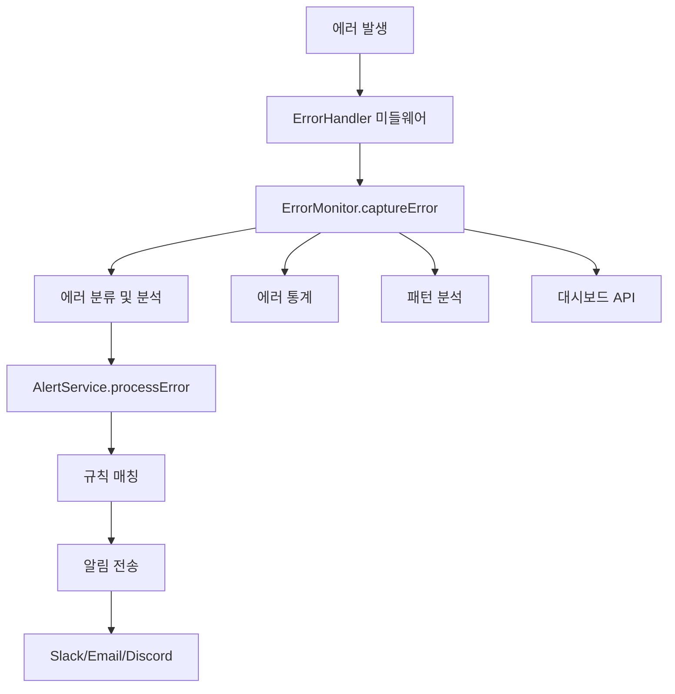

# 에러 모니터링 시스템 가이드

## 🎯 개요

TFT Meta Analyzer의 종합적인 에러 모니터링 시스템이 구현되었습니다. 이 시스템은 실시간 에러 감지, 자동 분류, 지능형 알림, 패턴 분석 등의 기능을 제공하여 안정적인 서비스 운영을 지원합니다.

## 🏗️ 시스템 아키텍처

### 핵심 컴포넌트

1. **ErrorMonitor** - 에러 캡처 및 분석
2. **AlertService** - 알림 규칙 관리 및 전송
3. **ErrorHandler** - 미들웨어 통합
4. **API 엔드포인트** - 대시보드 및 관리 기능

### 데이터 흐름



## 🚀 주요 기능

### 1. 자동 에러 분류

에러는 다음 카테고리로 자동 분류됩니다:

- **DATABASE** - 데이터베이스 관련 에러
- **API** - API 요청/응답 에러
- **AUTHENTICATION** - 인증/권한 에러
- **BUSINESS_LOGIC** - 비즈니스 로직 에러
- **EXTERNAL_SERVICE** - 외부 서비스 에러
- **PERFORMANCE** - 성능 관련 에러
- **SECURITY** - 보안 에러
- **UNKNOWN** - 미분류 에러

### 2. 심각도 자동 판정

- **CRITICAL** - 시스템 크래시, 치명적 에러
- **HIGH** - 데이터베이스, 인증, 보안 에러
- **MEDIUM** - 타임아웃, 네트워크, 성능 에러
- **LOW** - 일반적인 에러

### 3. 지능형 알림 시스템

#### 기본 알림 규칙

```typescript
// 치명적 에러 즉시 알림
{
  id: 'critical_errors',
  name: '치명적 에러 즉시 알림',
  conditions: {
    severity: [ErrorSeverity.CRITICAL],
    occurrenceThreshold: 1
  },
  channels: [AlertChannel.SLACK, AlertChannel.EMAIL],
  cooldown: 5, // 5분 쿨다운
  escalation: {
    delay: 15, // 15분 후 에스컬레이션
    channels: [AlertChannel.SMS]
  }
}

// 데이터베이스 에러 알림
{
  id: 'database_errors',
  conditions: {
    category: [ErrorCategory.DATABASE],
    occurrenceThreshold: 2,
    timeWindow: 10 // 10분 내 2번 발생
  },
  channels: [AlertChannel.SLACK, AlertChannel.EMAIL],
  cooldown: 15
}
```

## 📊 API 엔드포인트

### 에러 통계 조회
```bash
GET /api/error-monitor/stats?hours=24
```

**응답 예시:**
```json
{
  "success": true,
  "data": {
    "totalErrors": 147,
    "errorsByCategory": {
      "database": 23,
      "api": 89,
      "authentication": 12,
      "business_logic": 18,
      "external_service": 5
    },
    "errorsBySeverity": {
      "low": 98,
      "medium": 32,
      "high": 15,
      "critical": 2
    },
    "errorsByHour": [
      { "hour": "2024-01-01T00", "count": 12 },
      { "hour": "2024-01-01T01", "count": 8 }
    ],
    "topErrors": [
      {
        "fingerprint": "db_connection_timeout",
        "message": "MongoDB connection timeout",
        "count": 23,
        "lastOccurrence": "2024-01-01T12:30:00Z"
      }
    ]
  }
}
```

### 최근 에러 목록
```bash
GET /api/error-monitor/recent?limit=20&category=database&severity=high
```

### 에러 상세 정보
```bash
GET /api/error-monitor/error/AbC123XyZ
```

### 에러 해결 처리
```bash
POST /api/error-monitor/error/AbC123XyZ/resolve
Content-Type: application/json

{
  "resolvedBy": "admin@example.com"
}
```

### 에러 패턴 분석
```bash
GET /api/error-monitor/analysis
```

**응답 예시:**
```json
{
  "success": true,
  "data": {
    "spikes": [
      {
        "time": "2024-01-01T14:00:00Z",
        "count": 45
      }
    ],
    "trends": [
      {
        "category": "database",
        "trend": "increasing"
      }
    ],
    "correlations": [
      {
        "error1": "Database connection failed",
        "error2": "API timeout",
        "correlation": 0.85
      }
    ]
  }
}
```

## 🔧 설정 및 사용법

### 1. 기본 설정

```typescript
// backend/src/server.ts
import { errorMonitor } from './services/errorMonitor';
import { alertService } from './services/alertService';
import errorHandler from './middlewares/errorHandler';

// 에러 핸들러 미들웨어 등록
app.use(errorHandler);

// 알림 채널 설정
alertService.updateChannelConfig(AlertChannel.SLACK, {
  webhookUrl: process.env.SLACK_WEBHOOK_URL,
  channel: '#alerts',
  username: 'TFT Error Monitor',
  iconEmoji: ':warning:'
});

// 정기적인 메모리 정리
setInterval(() => {
  errorMonitor.cleanup();
  alertService.cleanup();
}, 24 * 60 * 60 * 1000); // 24시간마다
```

### 2. 커스텀 에러 캡처

```typescript
import { errorMonitor, ErrorCategory, ErrorSeverity } from '../services/errorMonitor';

// 비즈니스 로직에서 에러 캡처
try {
  await processUserData(userData);
} catch (error) {
  errorMonitor.captureError(error, {
    userId: user.id,
    endpoint: '/api/users/process',
    method: 'POST',
    additionalData: { userData }
  });
  throw error;
}
```

### 3. 커스텀 알림 규칙 추가

```typescript
import { alertService, AlertChannel, ErrorSeverity } from '../services/alertService';

// 사용자 인증 실패 알림
alertService.addRule({
  id: 'auth_failures',
  name: '인증 실패 급증 알림',
  description: '5분 내 인증 실패 10번 이상 발생 시 알림',
  enabled: true,
  conditions: {
    category: [ErrorCategory.AUTHENTICATION],
    occurrenceThreshold: 10,
    timeWindow: 5,
    messagePattern: 'authentication.*failed'
  },
  channels: [AlertChannel.SLACK, AlertChannel.EMAIL],
  cooldown: 10
});
```

## 🎨 프론트엔드 대시보드 구현

### React 컴포넌트 예시

```jsx
import React, { useState, useEffect } from 'react';

function ErrorMonitorDashboard() {
  const [stats, setStats] = useState(null);
  const [recentErrors, setRecentErrors] = useState([]);
  const [loading, setLoading] = useState(true);

  useEffect(() => {
    fetchErrorStats();
    fetchRecentErrors();
    
    // 30초마다 자동 새로고침
    const interval = setInterval(() => {
      fetchErrorStats();
      fetchRecentErrors();
    }, 30000);
    
    return () => clearInterval(interval);
  }, []);

  const fetchErrorStats = async () => {
    try {
      const response = await fetch('/api/error-monitor/stats?hours=24');
      const data = await response.json();
      setStats(data.data);
    } catch (error) {
      console.error('Failed to fetch error stats:', error);
    } finally {
      setLoading(false);
    }
  };

  const fetchRecentErrors = async () => {
    try {
      const response = await fetch('/api/error-monitor/recent?limit=50');
      const data = await response.json();
      setRecentErrors(data.data);
    } catch (error) {
      console.error('Failed to fetch recent errors:', error);
    }
  };

  const resolveError = async (fingerprint) => {
    try {
      await fetch(`/api/error-monitor/error/${fingerprint}/resolve`, {
        method: 'POST',
        headers: { 'Content-Type': 'application/json' },
        body: JSON.stringify({ resolvedBy: 'admin@example.com' })
      });
      
      // 성공 시 목록 새로고침
      fetchRecentErrors();
    } catch (error) {
      console.error('Failed to resolve error:', error);
    }
  };

  if (loading) return <div>Loading...</div>;

  return (
    <div className="error-monitor-dashboard">
      <h1>에러 모니터링 대시보드</h1>
      
      {/* 통계 카드 */}
      <div className="stats-grid">
        <div className="stat-card">
          <h3>총 에러 수</h3>
          <p className="stat-value">{stats?.totalErrors || 0}</p>
        </div>
        
        <div className="stat-card critical">
          <h3>치명적 에러</h3>
          <p className="stat-value">{stats?.errorsBySeverity?.critical || 0}</p>
        </div>
        
        <div className="stat-card high">
          <h3>높은 심각도</h3>
          <p className="stat-value">{stats?.errorsBySeverity?.high || 0}</p>
        </div>
        
        <div className="stat-card medium">
          <h3>중간 심각도</h3>
          <p className="stat-value">{stats?.errorsBySeverity?.medium || 0}</p>
        </div>
      </div>

      {/* 카테고리별 차트 */}
      <div className="category-chart">
        <h3>카테고리별 에러 분포</h3>
        <div className="chart-container">
          {Object.entries(stats?.errorsByCategory || {}).map(([category, count]) => (
            <div key={category} className="chart-bar">
              <div className="bar-label">{category}</div>
              <div className="bar-value" style={{ width: `${(count / stats.totalErrors) * 100}%` }}>
                {count}
              </div>
            </div>
          ))}
        </div>
      </div>

      {/* 최근 에러 목록 */}
      <div className="recent-errors">
        <h3>최근 에러 목록</h3>
        <div className="error-list">
          {recentErrors.map((error) => (
            <div key={error.fingerprint} className={`error-item ${error.severity}`}>
              <div className="error-header">
                <span className="error-category">[{error.category}]</span>
                <span className="error-severity">{error.severity}</span>
                <span className="error-time">{new Date(error.timestamp).toLocaleString()}</span>
              </div>
              
              <div className="error-message">{error.message}</div>
              
              <div className="error-meta">
                <span>발생 횟수: {error.occurrenceCount}</span>
                <span>엔드포인트: {error.context.endpoint}</span>
                <span>ID: {error.fingerprint}</span>
              </div>
              
              <div className="error-actions">
                {!error.resolved && (
                  <button 
                    onClick={() => resolveError(error.fingerprint)}
                    className="resolve-btn"
                  >
                    해결 처리
                  </button>
                )}
                <button className="details-btn">상세 보기</button>
              </div>
            </div>
          ))}
        </div>
      </div>
    </div>
  );
}

export default ErrorMonitorDashboard;
```

### 스타일링 (CSS)

```css
.error-monitor-dashboard {
  padding: 20px;
  max-width: 1200px;
  margin: 0 auto;
}

.stats-grid {
  display: grid;
  grid-template-columns: repeat(auto-fit, minmax(200px, 1fr));
  gap: 20px;
  margin-bottom: 30px;
}

.stat-card {
  background: white;
  border-radius: 8px;
  padding: 20px;
  box-shadow: 0 2px 4px rgba(0,0,0,0.1);
  text-align: center;
}

.stat-card.critical {
  border-left: 4px solid #dc3545;
}

.stat-card.high {
  border-left: 4px solid #fd7e14;
}

.stat-card.medium {
  border-left: 4px solid #ffc107;
}

.stat-value {
  font-size: 2em;
  font-weight: bold;
  margin: 10px 0;
}

.category-chart {
  background: white;
  border-radius: 8px;
  padding: 20px;
  margin-bottom: 30px;
}

.chart-container {
  margin-top: 15px;
}

.chart-bar {
  display: flex;
  align-items: center;
  margin-bottom: 10px;
}

.bar-label {
  width: 120px;
  font-weight: bold;
}

.bar-value {
  background: #007bff;
  color: white;
  padding: 5px 10px;
  border-radius: 4px;
  min-width: 30px;
  text-align: center;
}

.recent-errors {
  background: white;
  border-radius: 8px;
  padding: 20px;
}

.error-list {
  margin-top: 15px;
}

.error-item {
  border: 1px solid #ddd;
  border-radius: 8px;
  padding: 15px;
  margin-bottom: 10px;
}

.error-item.critical {
  border-left: 4px solid #dc3545;
}

.error-item.high {
  border-left: 4px solid #fd7e14;
}

.error-item.medium {
  border-left: 4px solid #ffc107;
}

.error-item.low {
  border-left: 4px solid #28a745;
}

.error-header {
  display: flex;
  justify-content: space-between;
  margin-bottom: 10px;
  font-size: 0.9em;
}

.error-category {
  background: #f8f9fa;
  padding: 2px 6px;
  border-radius: 4px;
  font-weight: bold;
}

.error-severity {
  text-transform: uppercase;
  font-weight: bold;
}

.error-message {
  font-weight: bold;
  margin-bottom: 10px;
}

.error-meta {
  font-size: 0.8em;
  color: #666;
  margin-bottom: 10px;
}

.error-meta span {
  margin-right: 15px;
}

.error-actions {
  display: flex;
  gap: 10px;
}

.resolve-btn {
  background: #28a745;
  color: white;
  border: none;
  padding: 6px 12px;
  border-radius: 4px;
  cursor: pointer;
}

.details-btn {
  background: #007bff;
  color: white;
  border: none;
  padding: 6px 12px;
  border-radius: 4px;
  cursor: pointer;
}

.resolve-btn:hover {
  background: #218838;
}

.details-btn:hover {
  background: #0056b3;
}
```

## 🔍 성능 최적화

### 1. 메모리 관리

```typescript
// 정기적인 메모리 정리
setInterval(() => {
  errorMonitor.cleanup();
  alertService.cleanup();
}, 24 * 60 * 60 * 1000); // 24시간마다

// 에러 저장소 크기 제한
const MAX_RECENT_ERRORS = 1000;
const MAX_ALERT_HISTORY = 1000;
```

### 2. 데이터베이스 최적화

```typescript
// 에러 데이터 영구 저장 (선택사항)
const errorSchema = new mongoose.Schema({
  fingerprint: { type: String, index: true },
  message: String,
  category: { type: String, index: true },
  severity: { type: String, index: true },
  timestamp: { type: Date, index: true },
  context: Object,
  resolved: { type: Boolean, default: false }
});

// TTL 인덱스로 자동 삭제
errorSchema.index({ timestamp: 1 }, { expireAfterSeconds: 30 * 24 * 60 * 60 }); // 30일
```

## 📈 모니터링 및 알림 설정

### Slack 연동 설정

```typescript
alertService.updateChannelConfig(AlertChannel.SLACK, {
  webhookUrl: process.env.SLACK_WEBHOOK_URL,
  channel: '#tft-alerts',
  username: 'TFT Error Monitor',
  iconEmoji: ':warning:'
});
```

### 이메일 알림 설정

```typescript
alertService.updateChannelConfig(AlertChannel.EMAIL, {
  smtp: {
    host: 'smtp.gmail.com',
    port: 587,
    secure: false,
    auth: {
      user: process.env.EMAIL_USER,
      pass: process.env.EMAIL_PASS
    }
  },
  recipients: ['admin@example.com', 'dev@example.com'],
  from: 'alerts@tft-analyzer.com'
});
```

### Discord 웹훅 설정

```typescript
alertService.updateChannelConfig(AlertChannel.DISCORD, {
  webhookUrl: process.env.DISCORD_WEBHOOK_URL,
  username: 'TFT Error Monitor',
  avatarUrl: 'https://example.com/avatar.png'
});
```

## 🚨 운영 가이드

### 1. 일상적인 모니터링

- **매일 오전**: 전날 에러 통계 확인
- **주간 리뷰**: 에러 트렌드 분석
- **월간 리뷰**: 알림 규칙 최적화

### 2. 에러 대응 프로세스

1. **즉시 대응** (Critical/High 에러)
   - 알림 수신 → 즉시 조사 → 임시 수정 → 근본 원인 분석

2. **일반 대응** (Medium/Low 에러)
   - 일일 리뷰 → 우선순위 결정 → 계획된 수정

### 3. 성능 모니터링

```bash
# 에러 모니터링 상태 확인
curl http://localhost:3000/api/error-monitor/health

# 시스템 메트릭 확인
curl http://localhost:3000/api/error-monitor/metrics
```

이 종합적인 에러 모니터링 시스템을 통해 TFT Meta Analyzer의 안정성과 신뢰성을 크게 향상시킬 수 있습니다. 실시간 에러 감지, 자동 분류, 지능형 알림을 통해 문제를 조기에 발견하고 신속하게 대응할 수 있습니다.